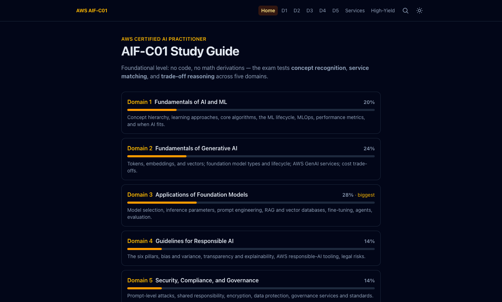

# AWS AIF-C01 Study Guide

A fast, mobile-friendly study site for the **AWS Certified AI Practitioner (AIF-C01)** exam, built from my personal master study notes.

**Live site:** https://autribaghkhanian.github.io/aws-aif-c01-study-guide/



## Features

- **8 pages**: exam overview, one page per domain (weighted 20/24/28/14/14%), a consolidated AWS service index, and 29 high-yield facts
- **Mobile-first tables**: wide comparison tables render as real tables on desktop and stacked labeled cards on phones
- **Redrawn diagrams**: the AI ⊃ ML ⊃ DL ⊃ GenAI hierarchy and lifecycle flows as responsive HTML — no images
- **Dark mode**: follows system preference, manual toggle persisted in `localStorage`
- **Offline-capable search**: [Pagefind](https://pagefind.app/) indexes the built site, so search runs fully client-side
- **Flashcard mode**: the 29 high-yield facts double as tap-to-flip quiz cards
- Ships almost no JavaScript — three small islands (theme, search, flashcards); everything else is static HTML

## Stack

[Astro 5](https://astro.build/) · [Tailwind CSS 4](https://tailwindcss.com/) · [Pagefind](https://pagefind.app/) · GitHub Pages via GitHub Actions

## Local development

```sh
npm install
npm run dev        # dev server (search inactive — index is built at build time)
npm run build      # astro build + pagefind index
npm run preview    # serve the built site with working search
```

## Structure

- `source/` — the original master study guide markdown, kept for provenance
- `src/pages/` — site pages (domains as MDX, converted from the source)
- `src/components/` — comparison tables, callouts, step-flow diagrams, search, flashcards
- `src/data/high-yield.json` — the 29 facts + flashcard prompts

## License

[MIT](LICENSE)
